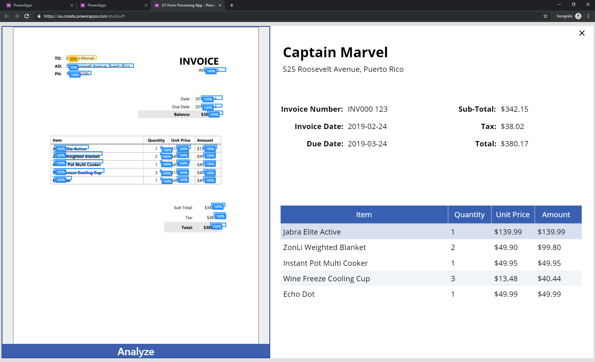
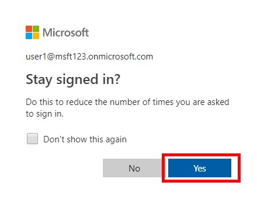
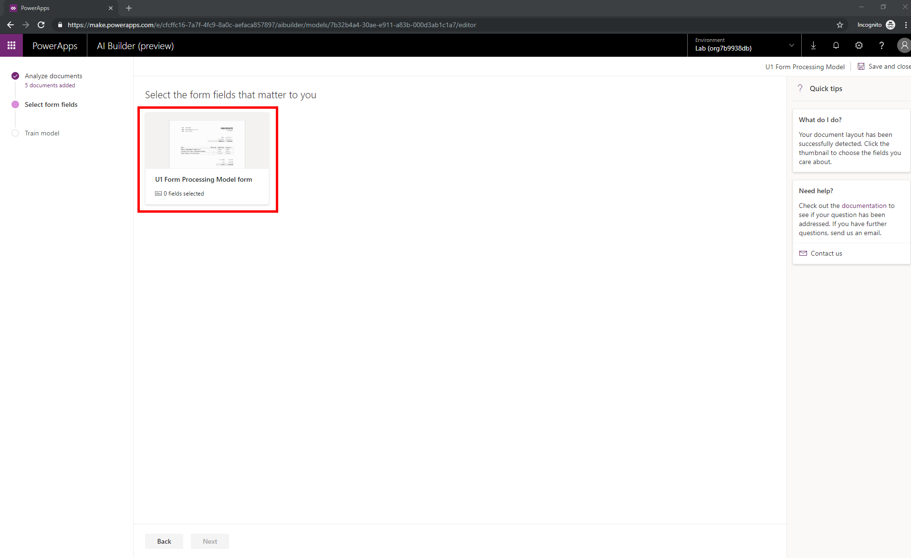
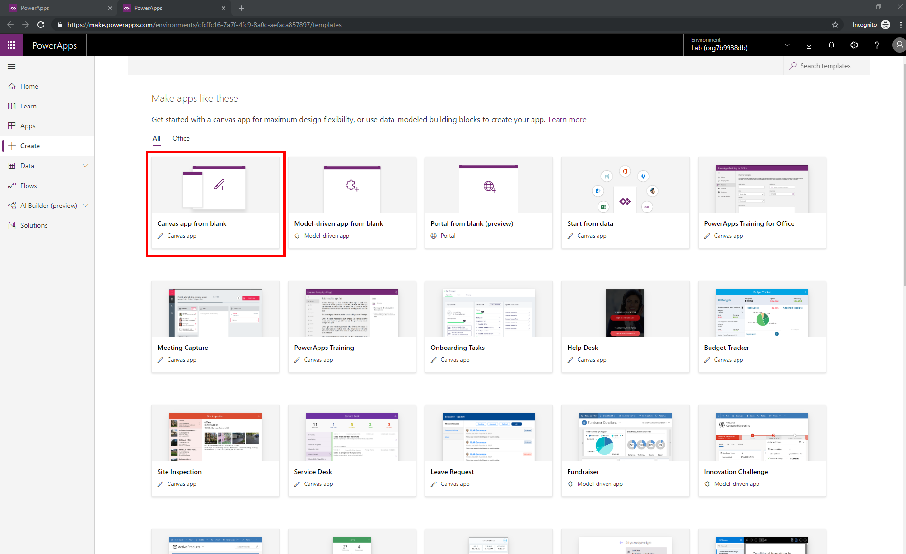
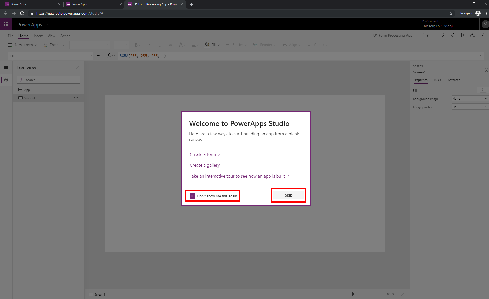
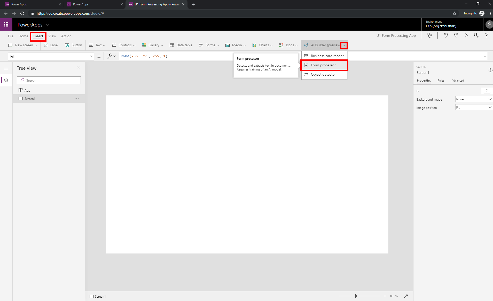
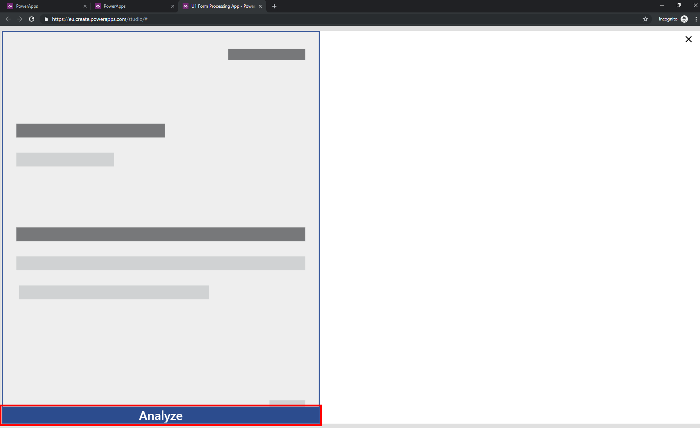
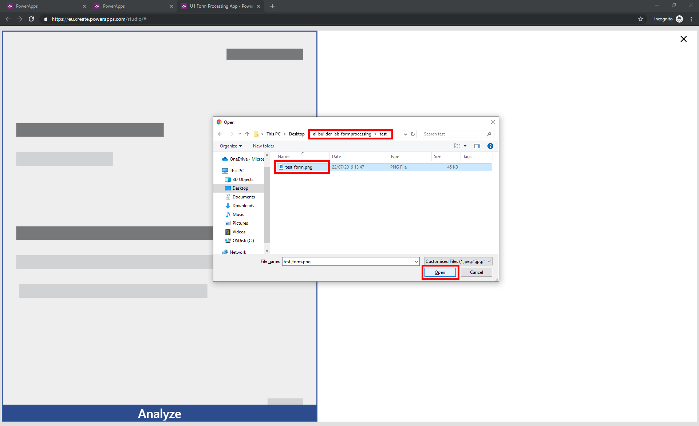
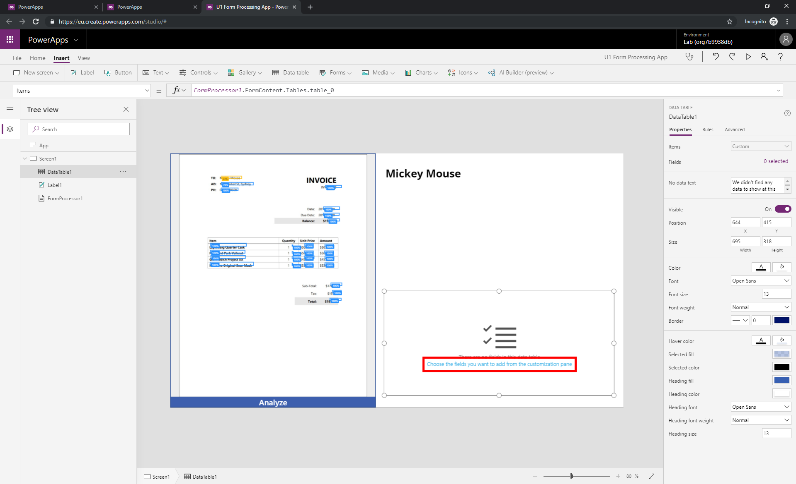

# Lab 1 - Form Processing
In this lab we will build, train, and publish, a form processing AI model that will be able to extract key-value pairs and table data. We will then create a simple form processing application that will leverage this AI model and render the processed results.

  

 

## Prerequisites
1. Meet the standard set of prerequisites required for all labs as outlined in the main [README](../README.md).
2. Download the [Form Processing Sample Data](../../../raw/master/data/ai-builder-lab-formprocessing.zip).
3. Extract the contents of the zip file on your local machine.

## Table of Contents
   [Step 1 - Sign in to PowerApps](#step-1---sign-in-to-powerapps)  
   [Step 2 - Select an Environment](#step-2---select-an-environment)  
   [Step 3 - Build, Train, and Publish an AI Model](#step-3---build-train-and-publish-an-ai-model)  
   [Step 4 - Create a Canvas app](#step-4---create-a-canvas-app)  

## Step 1 - Sign in to PowerApps
1. Navigate to [https://powerapps.microsoft.com/](https://powerapps.microsoft.com/) and click **Sign in**  
  

2. Enter your Microsoft account (email address) and click **Next**  
  

3. Enter your password and click **Sign in**  
  

4. When prompted to "Stay signed in", click **Yes**  
  

<a href="#lab-1---form-processing">↥ back to top</a>

## Step 2 - Select an Environment
Upon signing in, the default environment will be selected. Switch to an environment that has AI Builder enabled by opening the Environment drop-down menu at the top of the page. In this example, we would like to switch to the **Lab** environment.

Note: A prerequisite to this lab is that an environment is created in one of the supported AI Builder regions (United States or Europe).  
  

<a href="#lab-1---form-processing">↥ back to top</a>

## Step 3 - Build, Train, and Publish an AI Model
1. On the left side panel, expand **AI Builder**, click **Build**, and click **Form Processing**  
  

2. Provide your model a **name** (e.g. Form Processing Model) and click **Create**  
  

3. Click **Add documents**  
  

4. Navigate to the extracted contents of the provided [sample data](../../../raw/master/data/ai-builder-lab-formprocessing.zip) and select the five forms under the **training** folder. Click **Open**.  
  

5. Click **Upload 5 documents**  
  

6. Click **Close**  
  

7. Click **Analyze**  
  

8. Wait until AI Builder has finished analyzing the documents, this may take several minutes.  
  

9. Click the tile to open the form fields selector.  
  

10. Select all the fields on the form.  
  

11. Change a subset of the selected fields to have friendly names by hovering over an item in the side panel on the right, click the pencil icon to enter edit mode, overwrite the text (e.g. AD to Address), then click the tick icon to confirm. Repeat this for Name, Address, Phone, Invoice Number, and Invoice Date. Then click **Done** in the top right hand corner.  
  

12. Click **Next**  
  

13. Click **Train**  
  

14. Click **Go to Details page**  
  

15. Click **Publish**  
  

<a href="#lab-1---form-processing">↥ back to top</a>

## Step 4 - Create a Canvas app
1. Click **Create app**  
  

2. Click **Canvass app from blank**  
  

3. Provide the app a **name** (e.g. Form Processing App)  
  

4. If prompted with a "Welcome to PowerApps Studio" dialog box, check **Don't show me this again** and click **Skip**.  
  

5. Click **Insert** in the ribbon located on the top-left side of the page, expand **AI Builder (preview)** drop-down menu, click **Form processor**.  
  

6. Select your Form Processing Model.  
Note: If you are in a shared environment, there may be a number of models in this list built by different users. Use the search bar to locate your model.  
  

7. Drag the Form Processor component to the bottom left hand side and resize the object so that it stretches from top to bottom and about half of the width of the application.  
  

8. Click the **play** icon located on the top right hand side of the page.  
  

9. Click **Analyze**  
  

10. Navigate to the extracted contents of the provided [sample data](../../../raw/master/data/ai-builder-lab-formprocessing.zip) and select the test form under the **test** folder. Click **Open**.  
  

11. You should see all the field values have been identified. Click the **close** icon on the top-right corner of the page to return back to PowerApps Studio.  
  

12. If prompted with a "Did you know?" dialog box, check **Don't show me this again** and click **Ok**.  
  

13. Within the **Insert** ribbon, click **Label**. Drag the label to the right hand side of the Form Processor.  
  

14. Select the label by clicking on the object to bring it into focus, then update the **Text** property with the following formula: ``FormProcessor1.FormContent.Fields.Name``  
  

15. Change the formatting of the label by navigating to the **Home** ribbon, resizing the font to **24**, and making the item **Bold**.  
  

16. Navigate to the **Insert** ribbon and click **Data Table**.  
  

17. Close the Data panel.  
  

18. Drag the Data Table to the lower right hand corner of the app and resize accordingly.  
  

19. Select the Data Table by clicking on the object to bring it into focus, then update the **Items** property with the following formula: ``FormProcessor1.FormContent.Tables.table_0``  
  

20. Click **Choose the fields you want to add from the customization pane**  
  

21. Select the fields in this specific order: Item, Quantity, Unit Price, Amount. Click the **close** icon.  
  

22. While holding down the **Shift** key, click the following three columns in the Data Table: Quantity, Unit Price, and Amount. Release the **Shift** key. On the right panel, toggle **Can grow** to Off, change the **Width** to 100.  
  

23. Now that you understand the fundamentals of being able to map form field values to labels, repeat this process until your app looks like the below.  
  

24. Once complete, return to the preview mode by clicking the play button and analyzing another form from the training data set.  
  

<a href="#lab-1---form-processing">↥ back to top</a>

